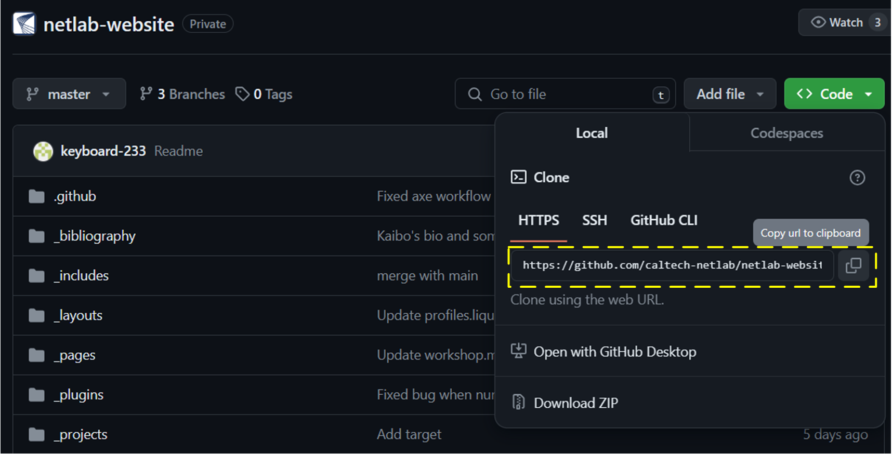

## Table Of Contents

- [Table Of Contents](#table-of-contents)
- [Making simple edits](#making-simple-edits)
- [Some references](#some-references)
- [Installing](#installing)
  - [Local setup on Windows 10/11](#local-setup-on-windows-1011)
  - [Local setup on Mac](#local-setup-on-mac)
  - [Git commands](#git-commands)
- [Instructions](#instructions)
  - [Research](#research)
  - [People](#people)
  - [Publications](#publications)
  - [Presentations](#presentations)
  - [Theming](#theming)
- [FAQ](#faq)

## Making simple edits

If you are making simple edits and do not need to visualize the changes (locally on your own machine) before making the changes public, go ahead and directly edit the relevant files either directly in [https://github.com/caltech-netlab] or in your local repository and push the changes to github.

## Some references

Check out [this tutorial](https://www.taniarascia.com/make-a-static-website-with-jekyll/) to learn more about Jekyll. Why Jekyll? Read [Andrej Karpathy's blog post](https://karpathy.github.io/2014/07/01/switching-to-jekyll/). Some other original references: [INSTALL.md](INSTALL.md), [CUSTOMIZE.md](CUSTOMIZE.md).

## Installing

### Local setup on Windows 10/11

First, install [Git](https://git-scm.com/), [Visual Studio Code](https://code.visualstudio.com/download), and [Windows Subsystem for Linux (WSL)](https://learn.microsoft.com/en-us/windows/wsl/install). For WSL, choosing the distribution of Ubuntu is fine. You can use any terminal and run the following command:

```shell
bash
```

to start WSL. Then, install [Node.js](https://learn.microsoft.com/en-us/windows/dev-environment/javascript/nodejs-on-wsl), [ImageMagick](https://learnubuntu.com/install-imagemagick/) and [Ruby & Jekyll](https://jekyllrb.com/docs/installation/windows/). After finishing the above installations, you can create a new Jekyll site and make it available on a local server, to determine if it works. Some commands you need can be seen [here](https://jekyllrb.com/docs/). Note that if you encounter any errors during the process, you can find some solutions on Google.

---

### Local setup on Mac
#### Local setup using Docker (Recommended)

Using Docker to install Jekyll and Ruby dependencies is the easiest way.

You need to take the following steps to get `al-folio` up and running on your local machine:

- First, install [docker](https://docs.docker.com/get-docker/) and [docker-compose](https://docs.docker.com/compose/install/).
- Finally, run the following command that will pull the latest pre-built image from DockerHub and will run your website.

```bash
$ docker compose pull
$ docker compose up
```

Note that when you run it for the first time, it will download a docker image of size 400MB or so. To see the template running, open your browser and go to `http://localhost:8080`. You should see a copy of the theme's demo website.

Now, feel free to customize the theme however you like (don't forget to change the name!). Also, your changes should be automatically rendered in real-time (or maybe after a few seconds).

> Beta: You can also use the slimmed docker image with a size below 100MBs and exact same functionality. Just use `docker compose up -f docker-compose-slim.yml`

#### Build your own docker image

> Note: this approach is only necessary if you would like to build an older or very custom version of al-folio.

Build and run a new docker image using:

```bash
$ docker compose up --build
```

> If you want to update jekyll, install new ruby packages, etc., all you have to do is build the image again using `--force-recreate` argument at the end of the previous command! It will download Ruby and Jekyll and install all Ruby packages again from scratch.

If you want to use a specific docker version, you can do so by changing `latest` tag to `your_version` in `docker-compose.yaml`. For example, you might have created your website on `v0.10.0` and you want to stick with that.

#### Local Setup (Legacy)

For a hands-on walkthrough of running al-folio locally without using Docker, check out [this cool blog post](https://george-gca.github.io/blog/2022/running-local-al-folio/) by one of the community members!

Assuming you have [Ruby](https://www.ruby-lang.org/en/downloads/) and [Bundler](https://bundler.io/) installed on your system (_hint: for ease of managing ruby gems, consider using [rbenv](https://github.com/rbenv/rbenv)_), and also [Python](https://www.python.org/) and [pip](https://pypi.org/project/pip/) (_hint: for ease of managing python packages, consider using a virtual environment, like [venv](https://docs.python.org/pt-br/3/library/venv.html) or [conda](https://docs.conda.io/en/latest/)_).

```bash
$ bundle install
# assuming pip is your Python package manager
$ pip install jupyter
$ bundle exec jekyll serve --lsi
```

To see the template running, open your browser and go to `http://localhost:4000`. You should see a copy of the theme's [demo website](https://alshedivat.github.io/al-folio/). Now, feel free to customize the theme however you like. After you are done, remember to **commit** your final changes.

---

### Git commands

When you make some major changes to the website, you can follow these steps:

1. Clone the repository to local.
```
git clone [url]
```


2. Check whether the local repository is up to date before each change.
```
git remote show origin
```

3. If not, fetch and merge changes to your local directory.
```
git pull
```

4. After making changes, push them to the remote repository.
```
git add .
git commit -m "[Descriptions of your changes]"
git push -u origin master
```

#### Deployment 
1. Run this once it is working locally the way you would like
```bash
$ bundle exec jekyll build --lsi
```
This will (re-)generate the static webpage in the `_site/` folder.
Then simply copy the contents of the `_site/` directory to your hosting server.

2. Drag and drop `_site/` folder out of root directory into downloads folder

3. Create new github repository for hosting 

4. Run these in terminal to connect to repository and push all code

```bash
$ git remote add origin <remote_repository_url>
$ git init
$ git add . 
$ git commit -m "Initial commit"
$ git push -u origin main
```

5. Create [Netlify account](https://www.netlify.com/)

6. Log in with GitHub

7. Push github repo to Netlify following instructions on page

## Instructions

### Research

This Jekyll theme implements `collections` to let you break up your work into categories. The theme comes with two default collections, `news` and `projects`. We only use the `projects` collection to create our research page. The overview of research is edited in the [\_pages/projects.md](_pages/projects.md), and the other four subsections are located in the [\_projects](_projects) folder. The contents of research are written using only HTML.

Additionally, if you want to create new collections, edit the collections in the [\_config.yml](_config.yml) and create a corresponding folder and a landing page in the [\_pages](_pages) folder.

```bash
$ #adding Links:
<a href='Link Goes Here'><b>Optimal placement of energy storage in distribution networks</b></a>
$ #adding Titles:
<div style="margin-bottom: 12px;"><font size='5.5' id = "applications">Applications</font></div>
$ #adding Figure:
<div style="text-align:center;">
  <figure>
    
    <figcaption>Figure 3: An example of a typical charging and discharging curve</figcaption>
  </figure>
</div>
$ #adding Bullet Points:
- content
```
---

### People

You can show each member's short bio and profile picture on the people page. There are three steps. First, add the profile picture in the [assets/img/people/](assets/img/people/) directory. Then, store the short bio in a `.md` file in the [\_pages/descriptions/](_pages/descriptions/) directory. Finally, you can add the member information under the appropriate category in the [\_pages/profiles.md](_pages/profiles.md).
```bash
- align: left
    image: faculty/steven-low-canonical.jpg
    content: descriptions/about_steven-low.md (add to descriptions file an md file and route it)
    role: CurrentGradStudent/Faculty/CurrentVisitingStudent/CaltechFacultyCollaborator/Admin/PreviousPostdoc/PreviousGrad/PreviousVisitingFaculty/PreviousVisitingStudent
    image_circular: false # crops the image to make it circular
    more_info: >
      <p>Steven H. Low</p>
      <a href = "http://netlab.caltech.edu/assets/documents/LowCV.pdf"><b>CV</font></b></a>
    lineBreak: (This is optional and used for styling to make sure everything is aligned) add '<br>' to add one line vertically
```
---

### Publications

The publications page is generated automatically from your BibTex bibliography. Simply edit the [\_bibliography/papers.bib](_bibliography/papers.bib). By default, the publications will be sorted by year, with the most recent displayed first. You can change this behavior and more in the `Jekyll Scholar` section in the [\_config.yml](_config.yml). Additionally, if you want to customize the look of the publications page, you can edit the [\_pages/publications.md](_pages/publications.md).

You just need to add some specific fields, as shown in the [\_bibliography/papers.bib](_bibliography/papers.bib). More supported fields can be found [here](https://github.com/alshedivat/al-folio).

---

### Presentations

The presentations page includes two parts, talks and misc writings, written using only HTML. If you have a new item to add, copy any existing item in [\_pages/presentations.md](_pages/presentations.md) and replace the key information in it.

---

### Theming

A variety of beautiful theme colors have been selected for you to choose from. The default is purple, but you can quickly change it by editing the `--global-theme-color` variable in the `_sass/_themes.scss` file. Other color variables are listed there as well. The stock theme color options available can be found at [\_sass/\_variables.scss](_sass/_variables.scss). You can also add your own colors to this file assigning each a name for ease of use across the template.

## FAQ

For frequently asked questions, please refer to [FAQ.md](FAQ.md).


