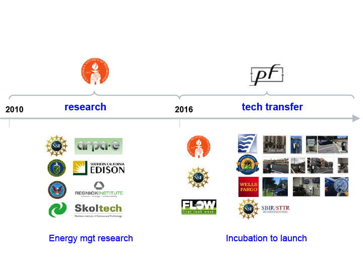

Electricity generation and transportation consume about two-third of energy in the US and emit more than half of greenhouse gases.

Vehicles consumed more than a quarter of energy and emitted more than a quarter of energy-related carbon dioxide in the US in 2014. Electrification of our transportation system will be an important component of future power systems because an electric vehicle (EV) is a huge load: an EV can add 50% energy consumption (4,000 kWh annually) to an average CA household and demand 2 to 20 times more power (3 – 20 kW) than an average CA household. It is however also an extremely flexible load hence invaluable for integrating renewable sources, such as wind and solar power, into our electric grid. We have worked on optimal scheduling of EV charging, and algorithms for EV battery swapping. We have also built an state-of-the-art EV charging system and transferred the technology through a startup.

  <figure>
    
    <figcaption>Figure 1: Power network evolution</figcaption>
  </figure>

Netlab's research focuses on some of the most fundamental challenges in this historic transformation.

<!-- pages/projects.md -->


  <!-- Display categorized projects -->
  
  <a id="{{ category }}" href=".#{{ category }}">
    <h2 class="category">{{ category }}</h2>
  </a>
  
  
  <!-- Generate cards for each project -->
  
  

    

    
      
    
    

  

  
  

    
      
    
  

  
  



<!-- Display projects without categories -->



  <!-- Generate cards for each project -->



  

    

    
      
    
    

  

  
  

    
      
    
  

  


